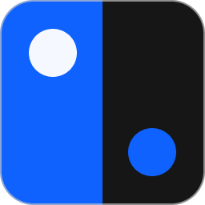

<p align="center">
  
</p>

<h1 align="center">Shadcn Theme Switch</h1>

<p align="center">
  A CLI + Figma plugin for syncing <code>shadcn</code> theme CSS, Figma Variables, and Token Studio-style collections.
</p>

<p align="center">
  <strong>Node.js &gt;=24</strong> · <strong>CLI Generator</strong> · <strong>Figma Plugin</strong> · <strong>Theme Import / Export</strong>
</p>

## Overview

This repository contains two connected tools:

- A local CLI that generates Figma / Token Studio collections from a `shadcn` preset or an existing project
- A Figma plugin that exports theme variables as CSS / CLI payloads and imports CSS back into Figma Variables

The current plugin workflow focuses on:

- `2. Theme`
- `3. Mode`

Importing CSS into Figma writes each import into a fresh timestamped Theme mode, so the existing `Default` mode is preserved.

## What It Does

- Generate collection files from a `shadcn` preset code or project path
- Reconstruct normalized theme CSS from local Figma Variables
- Produce a CLI payload you can apply back into a local project
- Import `shadcn` theme CSS into Figma Variables with preflight conflict checks
- Alias Theme variables to Tailwind-style variables whenever a safe match exists

## Quick Start

Install dependencies:

```bash
npm install
```

Run tests:

```bash
npm test
```

Build the Figma plugin:

```bash
npm run build:plugin
```

## Common Commands

Generate collections from a preset:

```bash
npm run generate -- --preset bdvx03LE --out generated
```

Generate collections from an existing project:

```bash
npm run generate -- --project /path/to/shadcn-project --out generated
```

Print theme CSS from a project:

```bash
node ./src/cli.js theme css --project /path/to/shadcn-project
```

Apply a plugin-generated payload back into a project:

```bash
node ./src/cli.js theme apply --project /path/to/shadcn-project --payload <base64url>
```

## Figma Plugin

1. Run `npm run build:plugin`
2. In Figma, load the plugin with `plugin/manifest.json`
3. Use `Export` to copy normalized CSS or a CLI command
4. Use `Import` to analyze pasted CSS and sync it into Figma Variables

The plugin currently supports:

- Color tokens
- Font families
- Radius
- Shadow
- Drop shadow
- Inset shadow
- Blur

## Typical Workflow

1. Generate a starting token set from a preset or project
2. Load the plugin inside Figma
3. Export the current variable state as CSS for review
4. Import updated CSS back into Figma when the theme changes
5. Apply the generated payload into a local project when needed

## Repository Layout

- `src/` — core generators, theme contract logic, CSS parsing, Figma variable mapping
- `plugin/src/` — Figma plugin source
- `blueprints/` — token blueprints used by generation and tests
- `scripts/` — build and generation helpers
- `test/` — Node test suite
- `DESIGN.md` — design and visual reference notes

## Notes

- `plugin/dist/` is intentionally not committed; build it locally before loading the plugin in Figma
- `generated/` is an output directory for local generation runs and is not part of the committed source
